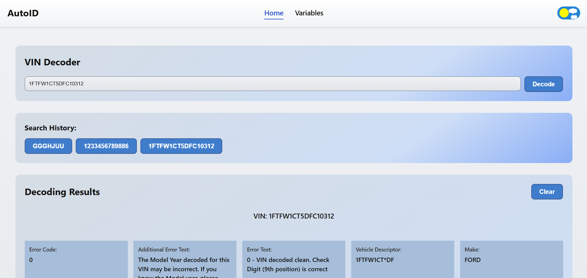

# AutoID - VIN Decoder



AutoID is a web application designed for decoding vehicle VIN (Vehicle Identification Number) codes. It allows users to retrieve detailed technical specifications of a vehicle quickly and efficiently by entering its unique identification number.

---

## 🚀 [Live Demo](https://vin-decoder-orcin.vercel.app/)

---

## 📋 Key Features

- VIN Decoding: Retrieve comprehensive vehicle technical specifications via API.

- Search & Filter: Search for vehicle variables by name or group.

- Pagination: User-friendly navigation through the variables list with 15 items per page.

- Interactive UI: Fully responsive design with support for Light and Dark themes.

- Detail View: Access extended information for each specific vehicle variable.

---

## 🏗 Architecture & Implementation

The application is built with a modular, scalable architecture, focusing on clean separation of logic and type safety.

- API Layer: Implemented with Redux Toolkit Query for declarative data fetching. It includes a custom baseQuery with an artificial delay to demonstrate loading states and centralized error handling through transformErrorResponse.

- State Management: Uses a unified Redux store that integrates API slices and middleware, ensuring efficient cache management and data consistency.

- Theme Management: A custom ThemeProvider using React Context API handles light/dark modes, with state persistence in localStorage.

- Validation: All input data (like VIN codes) is validated using Zod schemas, ensuring data integrity before any network request is initiated.

- Domain Logic: Application configurations (API endpoints, storage keys, constants) and TypeScript interfaces are centralized in constants/ and types/ folders to act as a "single source of truth."

- Custom Hooks: Business logic is encapsulated in custom hooks (like useHistory or useTheme), keeping UI components lightweight and easy to maintain.

---

## 🛠 Tech Stack

- Language: TypeScript

- Library: React

- State Management: Redux Toolkit (RTK Query)

- Theme Management: React Context API

- Routing: React Router

- Styling: CSS Modules

---

## Folder Structure

```text
src/
├── assets/                 # Static assets (preview image)
├── api/                    # API layer (RTK Query definitions and base queries)
│ ├── baseQuery.ts
│ ├── variables.api.ts
│ └── vin.api.ts
├── components/             # Reusable UI components
│ ├── Button/
│ ├── ErrorBlock/
│ ├── Header/
│ ├── Loader/
│ ├── MainLayout/
│ ├── VariableDetailCard/
│ ├── VariableSummaryCard/
├── constants/              # Global application constants
│ └── global.constants.ts
├── features/               # Complex, self-contained functional modules (e.g., ThemeToggler)
│ └── ThemeToggler/
├── helpers/                # Pure utility functions (data formatting, delay)
│ ├── dateFormat.ts
│ └── delayFn.ts
├── hooks/                  # Custom React hooks
│ ├── useHistory.ts
│ └── useTheme.ts
├── pages/                  # Page-level components (routes)
│ ├── HomePage/
│ ├── NotFoundPage/
│ ├── VariablePage/
│ ├── VariablesPage/
├── store/                  # Redux Toolkit store configuration
│ └── store.ts
├── theme/                  # Theme provider and design tokens
│ ├── index.ts
│ └── ThemeProvider.tsx
├── types/                  # TypeScript interfaces and enums
│ ├── global.enums.ts
│ └── global.types.ts
├── utils/                  # Helper utility for validation
│ └── validation.schema.ts
├── App.tsx
├── index.css
└── main.tsx
```

---

## How to run a project locally

Open a terminal and run the command:

### 1. Clone the repository:

```bash
git clone [https://github.com/AlexandraKurylo/vin-decoder](https://github.com/AlexandraKurylo/vin-decoder)
```

### 2. Install dependencies:

```bash
npm install
```

### 3. Start the development server:

```bash
npm run dev
```

### 4. Open in browser:

The app will be running at http://localhost:5173
